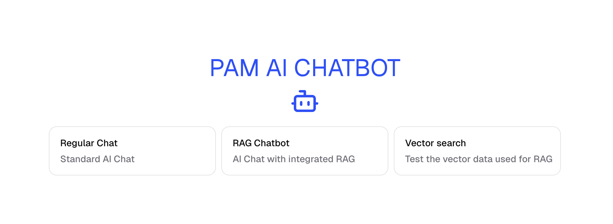

<a href="https://chat.vercel.ai/">
  
  <h1 align="center">PAM AI Chat bot</h1> 
</a>

<a href="https://vercel.com/new/clone?repository-url=https://github.com/OrkhanHuseynli/pam-chat-bot.git"></a>

<p align="center">
   This template is based on NextJS Chat SDK, a free, open-source template built with Next.js and the AI SDK that helps you quickly build powerful chatbot applications.
   This template adds RAG example along with Vector Search page on top of the original NextJs demo.
</p>

<p align="center">
  <a href="https://chat-sdk.dev"><strong>Original Chat SDK Docs</strong></a> ·
  <a href="#running-locally"><strong>Running locally</strong></a>
</p>
<br/>

## Running locally

### Install local dependencies

```bash
pnpm install
```

### Launch Postgres DB and Redis locally

```bash
pnpm docker:up
```

### Generate code and Run Migrations

```bash
pnpm db:generate
pnpm db:migrate
```

You will need to use the environment variables [defined in `.env.example`](.env.example) to run Next.js AI Chatbot. Put your env variables to `.env.local`.

### Seed data

This is data is necessary for the RAG example and Vector Search

```bash
pnpm seed
```

### Observe your DB in Drizzle Studio

```bash
pnpm db:studio
```

### Customizing Seed Data

You can replace the [seed data](./lib/db/seedData.ts) with your own content. Just ensure that your data conforms to the [IEmbeddedEntity](./lib/db/models.ts) interface. This way, no UI changes will be required when using your custom data.

### Run the app locally

```bash
pnpm dev
```

Your app template should now be running on [localhost:3000](http://localhost:3000).

NOTE: [Login](http://localhost:3000/login) to you app first http://localhost:3000/login

### Reference docs for the tech stack

- [Next.js](https://nextjs.org) App Router
  - Advanced routing for seamless navigation and performance
  - React Server Components (RSCs) and Server Actions for server-side rendering and increased performance
- [AI SDK](https://sdk.vercel.ai/docs)
  - Unified API for generating text, structured objects, and tool calls with LLMs
  - Hooks for building dynamic chat and generative user interfaces
  - Supports xAI (default), OpenAI, Fireworks, and other model providers
- [shadcn/ui](https://ui.shadcn.com)
  - Styling with [Tailwind CSS](https://tailwindcss.com)
  - Component primitives from [Radix UI](https://radix-ui.com) for accessibility and flexibility
- Data Persistence
  - [Neon Serverless Postgres](https://vercel.com/marketplace/neon) for saving chat history and user data
  - [Vercel Blob](https://vercel.com/storage/blob) for efficient file storage
- [Auth.js](https://authjs.dev)
  - Simple and secure authentication
